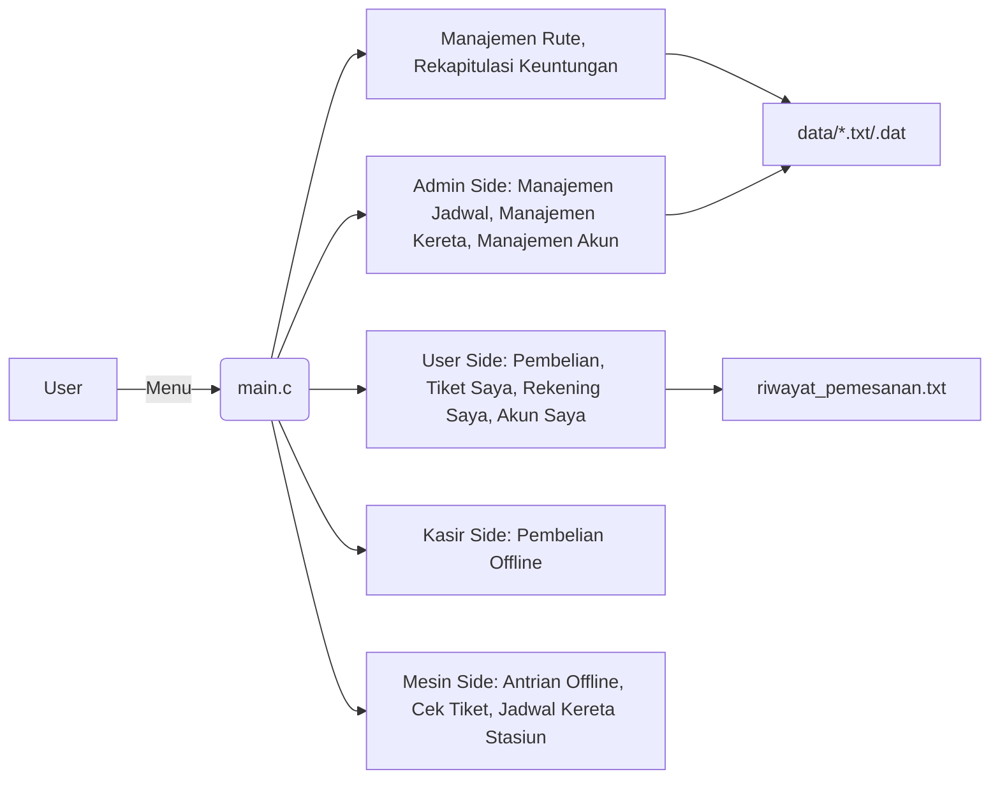

# 🚆 OurTrain

[](LICENSE)  
[]()

**📚 Tugas Kuliah**: Struktur Data & Algoritma  
**👩‍🏫 Dosen**: Wendi Wirasta, S.T, M.T  
**👥 Anggota Kelompok**:  
- Roufiel Hadi (241524028)  
- Devi Maulani (241524007)  
- Adi Rafi (241524001)  

---

## 📖 Deskripsi Proyek
OurTrain adalah aplikasi berbasis console untuk manajemen dan pemesanan tiket kereta api di Pulau Jawa. Proyek ini bertujuan untuk memahami penerapan berbagai struktur data dan algoritma dalam konteks real-world:
- **Queue (Antrean Offline)**: Menyimulasikan antrean pelanggan offline, memproses tiket sesuai urutan kedatangan (FIFO).  
- **Stack (Riwayat Transaksi)**: Menyimpan riwayat pemesanan tiket, mendukung fitur undo dan pencatatan (LIFO).  
- **Array Status Kursi**: Mengelola status ketersediaan kursi dalam dimensi gerbong×baris×kolom×segmen, mendukung reservasi multi-segmen, pembatalan, dan pemeriksaan ketersediaan.  
- **Array Dinamis & Linked List**: Menyimpan data kereta dan segmen perjalanan secara fleksibel.  
- **Tree Non-Biner & Biner**:  
  - Non-biner: Memetakan rute kereta dan stasiun sebagai graf hierarkis.  
  - Biner: Implementasi hashing password menggunakan kode Morse.  
- **Algoritma Pencarian Jalur**: BFS, DFS, dan algoritma greedy untuk menemukan rute terpendek antar stasiun.

---

## ✨ Fitur Utama
- 🔍 Pencarian jalur terpendek antar stasiun (BFS/DFS/Greedy).  
- 📍 Pencarian stasiun terdekat berdasarkan radius.  
- 🛋️ Visualisasi status kursi per gerbong dan segmen.  
- ➕ CRUD data stasiun dan kereta (tambah/hapus/edit).  
- 🔁 Antrean offline untuk pembelian di loket.  
- 🗒️ Riwayat transaksi dengan undo dan save ke file.  
- 🔒 Keamanan password dengan hashing kode Morse.  
- 🔄 Skrip otomatisasi kompilasi dan reset database.

---

## 🗂️ Struktur Proyek
```
/Program-OurTrain/
├── src/  
│   ├── main.c  
│   ├── queue.{h,c}            # Antrean offline (Queue)  
│   ├── stack.{h,c}            # Riwayat transaksi (Stack)  
│   ├── array.{h,c}            # Status kursi & data kereta (Array)  
│   ├── tree_non_biner.{h,c}   # Jaringan stasiun (Graf non-biner)  
│   ├── tree_biner.{h,c}       # Hashing password (Morse)  
│   ├── implementasi_*.{h,c}   # Modul bisnis (jadwal, pembelian, dll)  
│   └── hash_password.{h,c}     
├── data/  
│   ├── jadwal_kereta.txt  
│   ├── kursi_kereta.txt  
│   └── *.dat                  # Database biner/text  
├── scripts/  
│   ├── compile.bat  
│   └── reset_database.bat  
├── docs/  
│   └── screenshot.png  
└── README.md  
```

---

## 🚀 Instalasi & Penggunaan
```bash
# Clone repository
git clone https://github.com/RoufielHadi/ourtrain.git
cd ourtrain

# Kompilasi (Windows/MinGW)
scripts\compile.bat

# Jalankan aplikasi
OurTrain.exe

# Reset database (opsional)
scripts\reset_database.bat
```

---

## 🛠️ Arsitektur & Alur Sistem


---

## 🤝 Kontributor
- **Roufiel Hadi** – 241524028  
- **Devi Maulani** – 241524007  
- **Adi Rafi** – 241524001  

Politeknik Negeri Bandung • Teknik Informatika

---

## 📄 Lisensi
MIT © Tim OurTrain  
Lihat [LICENSE](LICENSE) untuk detail.
